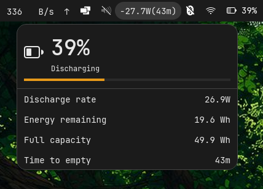

[](LICENSE)


# Power Monitor for the COSMIC Desktop

See your battery watts in the panel. Charge rate, discharge rate, time remaining at a glance.

If this saves you guesswork, star the repo.

## Screenshots

| Charging | Discharging |
|----------|-------------|
|  |  |

## What it does

- Panel shows text only: `-12.7W` discharging, `+26.5W` charging
- Popup displays percentage, status, charge/discharge rate, capacity, time remaining
- Polls `/sys/class/power_supply` 4 times per second

## Install

### Flatpak (recommended)

```bash
flatpak remote-add --if-not-exists --user cosmic https://apt.pop-os.org/cosmic/cosmic.flatpakrepo
flatpak install --user cosmic io.github.AceMythos.cosmic-ext-applet-power-monitor
```

### Build from source

```bash
# Install system deps
sudo apt install libxkbcommon-dev libfontconfig-dev libfreetype-dev libexpat1-dev cmake pkgconf

# Build
. "$HOME/.cargo/env"
cargo build --release

# Install
sudo install -Dm0755 target/release/cosmic-power-monitor /usr/local/bin/cosmic-power-monitor
sudo install -Dm0644 resources/io.github.AceMythos.cosmic-ext-applet-power-monitor.desktop \
    /usr/share/applications/
sudo install -Dm0644 resources/io.github.AceMythos.cosmic-ext-applet-power-monitor.svg \
    /usr/share/icons/hicolor/scalable/apps/
sudo install -Dm0644 resources/io.github.AceMythos.cosmic-ext-applet-power-monitor.metainfo.xml \
    /usr/share/metainfo/
```

Then add **Power Monitor** to your panel via COSMIC Settings -> Desktop -> Panel -> Add applet.

## How the reading works

The applet reads `power_now` from the kernel power-supply interface in `/sys/class/power_supply/BAT0/`. If `power_now` is unavailable, it derives watts from `current_now * voltage_now`.

The number is battery charge/discharge power, not total system draw. The label hides when no rate is available. The applet polls every 250ms.

## Requirements

- Pop!_OS 24.04+ with COSMIC desktop
- Rust toolchain (for source builds): `curl --proto '=https' --tlsv1.2 -sSf https://sh.rustup.rs | sh`

## License

MIT
